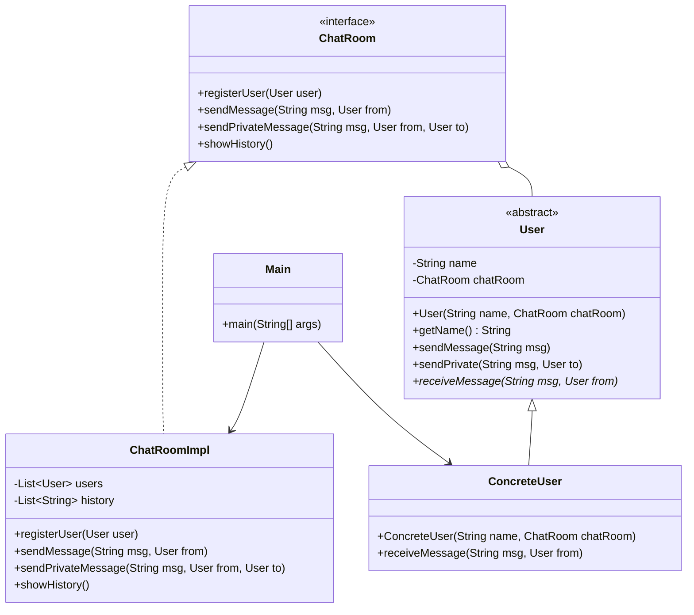

# Patrón de Diseño: Mediator

## Identificación

- **Tipo de patrón:** Comportamiento  
- **Patrón utilizado:** Mediator  

## Justificación

En un sistema de chat, si cada usuario se comunicara directamente con los demás, habría un fuerte acoplamiento y se dificultaría el mantenimiento.  
El **patrón Mediator** centraliza la comunicación en un único objeto (`ChatRoom`), que se encarga de gestionar los mensajes entre usuarios.  
Esto permite:  

- Reducir dependencias entre objetos.  
- Facilitar la extensión (agregar o quitar usuarios sin afectar al resto).  
- Mantener el código más claro y escalable.  

## Guía paso a paso — cómo se soluciona el problema y cómo se reflejan los beneficios

A continuación tienes una guía práctica y argumentada, paso a paso, que muestra **qué se hizo**, **por qué** y **cómo demostrar** que cada beneficio esperado está cumplido.

### Paso 1 — Entender el problema

**Problema:** Sin un mediador, cada usuario tendría referencias directas a todos los demás.  
**Consecuencia técnica:** acoplamiento punto-a-punto, alto coste de mantenimiento al añadir/eliminar usuarios y lógica de comunicación dispersa por muchos objetos.

### Paso 2 — Decidir el rol del Mediator

**Decisión de diseño:** crear una interfaz `ChatRoom` (el Mediator) que centralice:

- Registro y baja de usuarios.
- Envío de mensajes (broadcast y privados).
- Historial de mensajes / mensajes del sistema.

**Justificación:** centralizar responsabilidades evita que cada `User` conozca internamente la lista de otros usuarios.

### Paso 3 — Definir el contrato (archivo `ChatRoom.java`)

El contrato declara las operaciones mínimas que necesita la aplicación:

- `registerUser(User user)` — añade un usuario al Mediator.
- `unregisterUser(User user)` — (recomendado) elimina un usuario.
- `sendMessage(String msg, User from)` — broadcast.
- `sendPrivateMessage(String msg, User from, User to)` — privado.
- `showHistory()` / `getHistory()` — obtener historial para evidencias.

**Por qué:** separar el *qué* (API) del *cómo* (implementación), facilita pruebas y futuras implementaciones.

### Paso 4 — Modificar la clase `User` para delegar al Mediator (`User.java`)

- Cada `User` mantiene **solo** una referencia al `ChatRoom` (no a otros usuarios).
- Métodos:
  - `sendMessage(msg)` → delega en `chatRoom.sendMessage(...)`.
  - `sendPrivate(msg, to)` → delega en `chatRoom.sendPrivateMessage(...)`.
- `receiveMessage(msg, from)` → método abstracto que implementan los usuarios concretos.

**Resultado:** la lógica de envío/recepción queda fuera de `User`, reduciendo acoplamiento.

### Paso 5 — Implementar `ChatRoomImpl` (el Mediator real)

Responsabilidades y detalles de implementación:

- **Colección de usuarios:** `Map<String, User>` o `List<User>` — facilita búsquedas y evita duplicados.
- **Historial sincronizado:** `List<String>` que guarda eventos del sistema y mensajes (útil para evidencia).
- **Register / Unregister:** encapsulan la actualización de la colección; emiten mensaje del sistema y no requieren cambios en otras clases.
- **sendMessage:** inserta registro en historial y reenvía a todos excepto al remitente.
- **sendPrivateMessage:** busca al receptor en la colección; si no existe, envía notificación al remitente.

**Cómo demuestra los beneficios:** toda la lógica de distribución está aquí; añadir nuevos tipos de mensaje o reglas se cambia solo en `ChatRoomImpl`.

### Paso 6 — Implementar `ConcreteUser`

Un `ConcreteUser` implementa `receiveMessage` y decide cómo mostrar el mensaje (por ejemplo, imprimir en consola).  
Esto mantiene la responsabilidad de presentación en el cliente y la lógica de enrutamiento en el Mediator.

### Paso 7 — Pruebas manuales (ejecutar `Main`)

1. Compila y ejecuta:

   ```bash
   javac chat/*.java
   java chat.Main
   ```

2. Observa la consola: verás mensajes de sistema al registrar usuarios, mensajes recibidos por cada usuario y el historial final.  
3. Pruebas rápidas a realizar:
   - **Agregar un usuario nuevo** (ej. `Dave`) solo creando el objeto y llamando a `registerUser(dave)`. **No** modificar clases existentes.  
   - **Eliminar (unregister)** a `Carol` y comprobar que los demás siguen funcionando sin cambios.  
   - **Enviar privado** a un usuario inexistente y comprobar que el remitente recibe "Usuario no encontrado".

### Paso 8 — Cómo cada beneficio queda reflejado (evidencia técnica)

1. **Facilita el mantenimiento**
   - Evidencia: para agregar `Dave` solo se crea `new ConcreteUser("Dave", chat); chat.registerUser(dave);` — no se tocan otras clases.  
   - En la implementación, `users` en `ChatRoomImpl` gestiona la colección; agregar/eliminar se hace en un único lugar.

2. **Mejor organización**
   - Evidencia: la lógica de envío/recepción (broadcast/private) está en `ChatRoomImpl`. `User` solo sabe cómo enviar (delegar) y cómo mostrar (recibir).  
   - El historial centralizado (`history`) documenta todo el flujo, lo que facilita auditoría y debugging.

3. **Reduce la complejidad**
   - Evidencia: antes, N usuarios requerían O(N²) relaciones. Con Mediator, la complejidad de mantenimiento es O(N) (la sala gestiona la lista).  
   - Código explícito: `for (User u : users) if (u != from) u.receiveMessage(...)` — la relación entre usuarios ya no está definida en cada `User`.

### Paso 9 — Pruebas automatizadas y verificación

- Añadir tests unitarios (JUnit) que verifiquen:
  - Broadcast: todos reciben excepto el emisor.
  - Privado exitoso: receptor recibe el mensaje.
  - Privado fallido: remitente recibe mensaje de error del sistema.
  - Registro / baja: `history` contiene eventos de `SYSTEM`.
- Resultado esperado: pruebas que demuestren los beneficios solicitados.

## Diagrama UML



## Código Fuente (archivos clave)

- `src/chat/ChatRoom.java`  
- `src/chat/ChatRoomImpl.java`  
- `src/chat/User.java`  
- `src/chat/ConcreteUser.java`  
- `src/chat/Main.java`  

## Ejecución y evidencia

Compilar:

```bash
cd src
javac chat/*.java
```

Ejecutar:

```bash
java chat.Main
```

Salida esperada:

```

Alice se unió al chat.
Bob se unió al chat.
Carol se unió al chat.
[Bob] recibido de Alice: Hola a todos!
[Carol] recibido de Alice: Hola a todos!
[Alice] recibido de Bob: Hola Alice, ¿cómo estás?
[Alice] recibido de Carol: Hola grupo!
[Bob] recibido de Carol: Hola grupo!

--- Historial ---
SYSTEM: Alice se unió al chat.
SYSTEM: Bob se unió al chat.
SYSTEM: Carol se unió al chat.
Alice -> ALL: Hola a todos!
Bob -> Alice: Hola Alice, ¿cómo estás?
Carol -> ALL: Hola grupo!

--- Chat terminado ---
```
